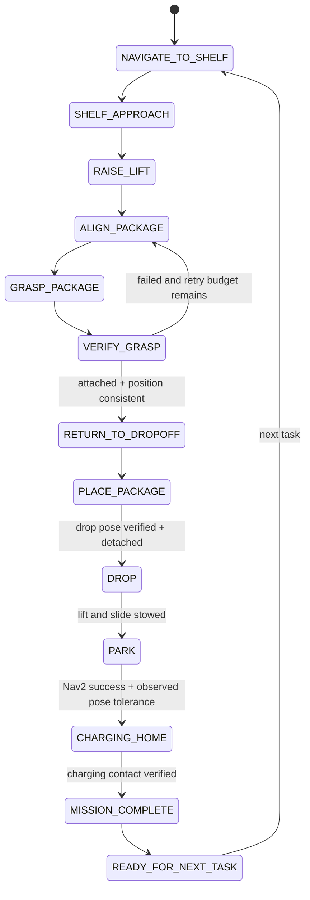

# BFMC warehouse mission with predictive V-JEPA integration

This is the implementation and validation guide for `goal.md`. The existing
Nav2, camera servo, VQA color detector, detachable-joint gripper, and V-JEPA
localization paths remain in place. Prediction and evidence are added around
those working components.

## Architecture

```mermaid
flowchart LR
    CAM[Gazebo / RealSense camera] --> RELAY[/vjepa/camera/image_raw]
    RELAY --> VJ[V-JEPA2 encoder + temporal localizer]
    VJ --> LAT[/vjepa_latent]
    VJ --> DBG[/vjepa_localization/debug]
    VJ --> POSE[/vjepa_pose]

    PEOPLE[Tracked human poses] --> BP[Predictive behavior planner]
    BP -->|global WAIT / PASS / REPLAN + reason| DEC[/warehouse/behavior_decision]
    BP -->|per-human rollout evidence| OBS[/warehouse/behavior_observation]
    BP --> STOP[/warehouse/person_stop]
    STOP --> MUX[Velocity safety mux]

    MISSION[Warehouse mission state machine] --> STATE[/warehouse/mission_state]
    MISSION --> NAV[Nav2 A* + MPPI]
    DEC -->|bounded cancel/resend on REPLAN| NAV
    NAV --> GOV[Corner speed governor]
    GOV --> MUX
    MISSION --> SERVO[Camera visual servo]
    SERVO --> GRASP[Lift + suction grasp verification]

    RELAY --> LOG[Async latent rollout logger]
    LAT --> LOG
    DBG --> LOG
    STATE --> LOG
    DEC --> LOG
    OBS --> LOG
    LOG --> EVIDENCE[Frames, poses, latents, z(t+1..3), metrics, plots]
    LOG --> PRED[/vjepa/latent_prediction]
    PRED --> QA[Predictive query-answer dashboard]
    DEC --> QA
    STATE --> QA
```

The prediction logger is a separate process with a bounded queue. It consumes
embeddings already published by the localizer and never runs disk I/O or
rollout evaluation in the GPU inference callback or vehicle control path.

## ROS2 node and topic changes

| Component | Input | Output / behavior |
|---|---|---|
| `person_safety_monitor.py` | AGV and human tracks | `/warehouse/behavior_decision` carries the highest-risk `WAIT`, `PASS`, or `REPLAN`; `/warehouse/behavior_observation` preserves every scenario-human rollout and reason; `/warehouse/person_stop` stays compatible |
| `CabinetRouteNavigator` | behavior decisions, Nav2 feedback | Cancels/resends once for a bounded `REPLAN`; retains goals during `WAIT`; publishes mission states and curvature speed limits |
| `keyboard_cmd_mux.py` | person stop gate, Nav2/manual velocity | Immediate zero for `WAIT`/`REPLAN`; resumes the retained command for `PASS` |
| `VqaNav2Mission` | camera, LiDAR, joint, attachment and Gazebo station feedback | Detailed pick states, configurable retry, verified drop and the complete park/charge/ready recycle loop |
| `latent_prediction_monitor.py` | camera, V-JEPA latent/debug, mission and behavior state | Raw frames, latent vectors, vehicle poses, rollouts, logs, metrics, summary and PNG visualizations |
| `localization_dashboard.py` | V-JEPA pose/rollout, behavior decision, mission state, LiDAR | Answers live localization, future occupancy, planner-reason, latent-metric and lifecycle questions |

No custom message package is required. Structured contracts use JSON in
`std_msgs/String`; the existing Boolean emergency gate remains stable.

## Mission state machine



The default `pick_box.sh` request already specifies `A/blue`. It resolves A01
before motion and combines the dock-to-staging and staging-to-A01 latent
segments into one Nav2 action. Interactive selection remains supported and
retains the two-stage path.

## Human prediction and planner policy

Every person track keeps 12 samples. Least-squares velocity is estimated from
the history, then a constant-velocity occupancy trajectory is rolled out at
0.25 s intervals over four seconds. The planner advances a conservative
nominal AGV trajectory and computes separation, corridor occupancy, collision
probability, time-to-collision, and the predicted free-space window.

- `WAIT`: emergency envelope occupied or TTC is inside the required pass
  window. The current Nav2 goal/path is retained and steering is zero.
- `PASS`: predicted risk is below threshold and at least a 2 s free-space
  window exists. After a bounded wait it also permits a tracked stationary
  Human #2 at least 0.55 m off center and 1.20 m away to be overtaken for a
  five-second authorization window. The local MPPI costmap owns the
  collision-free pass and the emergency radius still overrides it.
- `REPLAN`: the blockage persists for 10 s. Only one replan is requested per
  15 s cooldown. Human #1 normally moves before this, avoiding rerouting.

The decision JSON always contains its reason and numeric inputs. Runtime
records go to `$WAREHOUSE_LOG_DIR/behavior_decisions.jsonl`.

## Gazebo scenarios

- Human #1 (`random_worker_4`) waits outside the east-west route and crosses
  through `(7.5, -10)` when the AGV comes within 3.2 m. It consumes one
  traversal per mission, remains at the safe opposite endpoint, then crosses
  in the reverse direction on the next mission. Mission triggers never reset
  or teleport its pose. This proximity scenario is enabled by default.
- Human #2 (`random_worker_5`) continuously walks a 7.8 m open-floor
  left-right patrol. It has no endpoint dwell or mission-time trigger; the
  planner obtains safe windows from its measured direction and velocity.
- The other three workers retain their previous randomized behavior.

## V-JEPA future prediction and evidence

`LatentRolloutPredictor` is a causal dynamics head over frozen normalized
V-JEPA2 embeddings. It estimates smoothed latent velocity and emits explicit
`z(t+1)`, `z(t+2)`, and `z(t+3)`. It is separate from the encoder so an
action-conditioned V-JEPA2 predictor can later replace it without changing
topics, logs, or evaluation.

Each actual embedding matures pending predictions and records mean L1 error,
cosine similarity, predicted/actual latent displacement, prediction drift
error, and L2 residual.

Output under
`vjepa_visual_localization/outputs/warehouse_latent_predictions/<UTC run>/`:

```text
frames/                         raw mission frames
latents/                        actual V-JEPA vectors
predictions/                    z(t+1), z(t+2), z(t+3)
behavior_visualizations/        current frame + latent heatmaps + decision
samples.jsonl                   timestamp, pose, phase and artifact paths
latent_metrics.jsonl            per-origin/per-horizon comparison
latent_prediction_metrics.png  L1, cosine and drift plots
mission_states.jsonl            ordered state-transition evidence
summary.json                    aggregate metrics and coverage
```

Scenes cover normal driving, both human encounters, Shelf A approach, pickup,
and return. Requested behavior figures are `human_leaves_path.png`,
`human_continues_crossing.png`, and `vehicle_can_safely_pass.png` when those
events occur.

The rollout predicts representations, not RGB pixels. Figures render latent
heatmaps rather than pretending to decode an encoder-only checkpoint.

The logger retains a raw-camera ring buffer and selects the frame nearest the
V-JEPA clip-center timestamp after inference. Every row records both frame and
latent timestamps, their alignment error, the actual `/vjepa_latent` source,
and the V-JEPA pose/debug source. This prevents a newer frame from being
mislabelled as the input associated with an older latent.

The async writer also publishes compact rollout evidence on
`/vjepa/latent_prediction`. The dashboard joins it with
`/warehouse/behavior_decision` and `/warehouse/mission_state`; query answers
report observed risk, TTC, free window, planner reason, rollout
horizons/metrics and lifecycle state. These are deterministic renderings of
measured contracts, not a claimed end-to-end language decoder.

Streaming QA is not a video replay. The 20 prompts are fixed from `qa.txt`,
while the default `hybrid` answer source uses known policy rules plus the
current stream's motion, LiDAR, worker, plan, mission-state and latent-rollout
signals. This remains valid when a mission repeats with another shelf/color.
The optional `video_hardcoded` mode exists only for offline reproduction of
the supplied MP4 annotations and is never selected by the normal mission.

## Pick and place

The existing detector and physical Gazebo grasp are reused. A grasp passes
only when all requested categories pass:

1. detection confidence exceeds the configured threshold;
2. registered shelf pose, camera center, contact pose, yaw and height agree;
3. detachable-joint state reports attached and payload position is consistent.

On failure, the slide must retract, an accidentally attached payload is
detached, the AGV retreats 0.25 m, and alignment/grasp retries.
`pipeline.grasp.max_retries` controls the budget (default two retries / three
total attempts). Failed retraction aborts because moving with an extended tool
is unsafe.

## Second Shelf A turn: root cause and fix

The active controller is MPPI behind Nav2's rotation shim. PID, Pure Pursuit,
and Stanley parameters do not exist in this repository and were not blindly
tuned.

Inspection identified three coupled causes:

1. the known A/blue mission ended its first action at cabinet staging and
   started the shelf leg as a second action, hiding the shared 90-degree apex
   from smoothing and the MPPI horizon;
2. `prune_hard_corner_checkpoints` deleted an apex, allowing a long diagonal
   that began cross-track correction after the corner;
3. the 1.35 m/s cruise and closed-loop smoothing were stable, but the short
   base traversed substantial distance during steering response there.

Implemented correction:

- combine adjacent latent legs for the preselected A/blue mission;
- replace hard apexes with bounded quadratic transitions inside both aisles;
- orient intermediate goals from stable path tangents;
- finish coarse shelf navigation on the route tangent and leave the 90-degree
  rack-facing rotation/range approach to the existing low-speed camera servo;
- publish a 0.40 m/s Nav2 limit within 2.50 m of a hard corner and remove it
  after the turn;
- retain closed-loop 40 Hz smoothing and existing MPPI/costmap safety.

Expected and required result: at least 20% reduction in maximum outgoing
lateral error while route RMSE and p95 cross-track error remain within 5% of
baseline. `trajectory_evaluation.py` implements these comparisons.

## Validation procedure and metrics

1. Start simulation with `./run_demo.sh` and run `./pick_blue_box.sh`.
2. Retain behavior logs, the latent prediction run, and
   `$WAREHOUSE_LOG_DIR/warehouse_trajectory.csv`.
3. Repeat the same seed for baseline and candidate profiles.
4. Run `tools/validate_warehouse_run.py` with the latent and baseline-latent
   runs, behavior log, reference route and baseline/candidate trajectories. It
   fails closed if performance evidence is absent.
5. Compare V-JEPA `inference_ms` p50/p95 in `samples.jsonl`; maximum permitted
   regression is 5%.

Acceptance metrics:

- `MISSION_COMPLETE` is reached through every named manipulation state, then
  terminal `READY_FOR_NEXT_TASK` is reached through ordered
  `DROP -> PARK -> CHARGING_HOME` feedback gates;
- zero human collision/contact samples;
- both humans have decisions/reasons and runtime `WAIT`/`PASS` evidence;
- all six critical latent scenes and horizons 1/2/3 have actual metrics;
- route RMSE/p95 are no worse than 1.05x baseline;
- second-turn overshoot is no more than 0.80x baseline;
- V-JEPA p95 inference latency is no worse than 1.05x baseline.

## Test scenarios

1. Static Human #1 triggers `WAIT`, moves on proximity, then `PASS`/resume.
2. Human #2 intersects within two seconds and produces `WAIT`.
3. Human #2 moves away and produces a safe `PASS` window.
4. A persistent blocker produces one `REPLAN`, then cooldown `WAIT`.
5. Shelf A blue completes confidence, contact and attachment gates.
6. Injected grasp failure retracts, retreats, realigns and retries.
7. A synthetic 90-degree route stays inside aisle bounds after rounding.
8. Latent tests verify all horizons plus frames, vectors, poses, metrics,
   summary, plots and behavior image.
9. Recycle tests reject out-of-tolerance home poses and out-of-order lifecycle
   transitions without using a timed charging decision.

## Failure cases and safe response

| Failure | Response |
|---|---|
| stale AGV pose | fail-safe `WAIT` and zero velocity |
| stale person track | discard it; other fresh tracks remain authoritative |
| short free window / high collision probability | `WAIT`, retain path |
| persistent blockage | one cooldown-limited `REPLAN` |
| logger cannot keep up | drop newest evidence sample and count it; control unaffected |
| malformed/non-finite latent | reject sample, keep logger alive |
| target absent or low confidence | safe retract/retreat and bounded retry |
| contact/attachment inconsistent | detach if needed, retract, retry or abort |
| slide cannot retract | abort; do not move the base |
| payload attached or hardware not stowed after drop | abort before parking |
| observed home pose outside charging tolerance | do not publish charging/ready |
| missing trajectory baseline | validator reports failure, never a guessed pass |

## Implementation roadmap

- Complete: predictive human tracking and decision contract.
- Complete: requested Gazebo human behaviors and safe actuation mapping.
- Complete: mission states, grasp retries, and continuous Shelf A route.
- Complete: asynchronous latent rollout, evidence and metrics pipeline.
- Complete: predictive QA joins planner, latent rollout and lifecycle topics.
- Complete: verified drop, park, charging/home and ready-for-next-task loop.
- Complete: unit/artifact tests and strict runtime validator.
- Runtime gate: archive repeated baseline/candidate simulation trials on the
  target GPU/physics host before deployment.
- Production follow-up: replace Gazebo tracks with detector/tracker output,
  detachable-joint state with vacuum feedback, and the online latent dynamics
  head with an action-conditioned V-JEPA2 predictor checkpoint.
